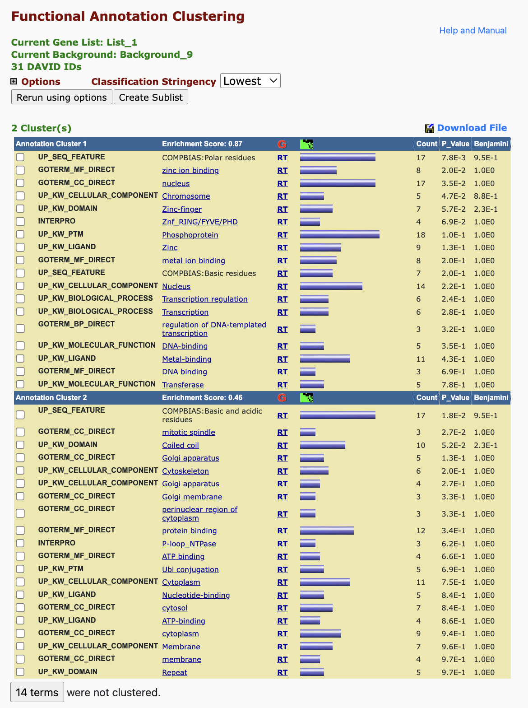
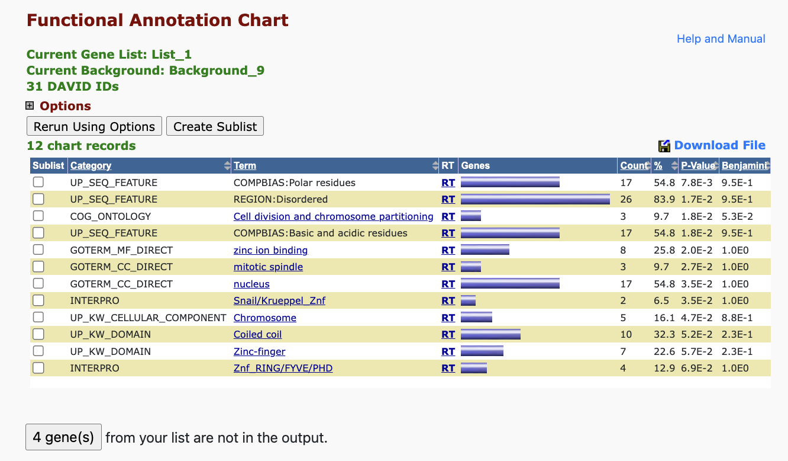

```{r}

# load installed packages
library(dplyr)
library(tidyr)
```

### read in DEG and BLAST data

```{r}

stats <- read.csv("../output/DEGstats_ToC_8ind27r.tab", sep="")
head(stats)

stats$LOC <- row.names(stats)
head(stats)


blast <- read.csv("../output/blastout_cds_genelevel.tab", sep="")
head(blast)
```

### join deg info to blast info by LOC

```{r}
# prep column name to match for join 

blast <- blast %>% rename("LOC" = "gene")
head(blast)

```

```{r}

DEG_annot <- left_join(stats, blast, by = "LOC")
head(DEG_annot)

row.names(DEG_annot) <- DEG_annot$LOC
head(DEG_annot)

```

### getting uniprot info

first need to extract SwissProt IDs

```{r}

SPID <- DEG_annot$SPID
head(SPID)

write(SPID, "../output/DEG_SPID_star.txt")


```

went to uniprot website, mapped SPIDs, saved output table (default settings) as tsv and unzipped. importing here.

```{r}

uniprot <- read_delim("../output/idmapping_2025_05_01.tsv")
head(uniprot)

colnames(uniprot)[colnames(uniprot) == "From"] <- "SPID"
head(uniprot)
```

### join blast and uniprot info

```{r}

DEG_annot2 <- left_join(DEG_annot, uniprot, by = "SPID")
head(DEG_annot2)

write_csv(DEG_annot2, "../output/DEG_annot.csv", col_names = T)

```

### Creating master list by adding back in ncbi info from original count matrix (NCBI gene names, gene type)

```{r}

uni <- read.csv("../output/DEG_annot.csv")
head(uni)

ncbi <- read.csv("../data/STAR_count_data.csv", row.names = 1)
head(ncbi)

```

```{r}
# naming column in ncbi DF to prep for join using the LOC names contained in row names

ncbi$LOC <- rownames(ncbi)
head(ncbi)
```

```{r}
# joining to get gene type info added to annotated DEG list

DEG_list <- left_join(uni, ncbi, by = "LOC")
head(DEG_list)

write.csv(DEG_list, "../output/DEG_masterlist.csv", col.names = T)
```

### Full SPID list (all genes expressed after filter)

Needed for enrichment analysis background

```{r}

allgenes <- read.csv("../output/DESeq_res-ToC_8ind27r.tab", sep="")
head(allgenes)

allgenes$LOC <- row.names(allgenes)
head(allgenes)

```

```{r}
# join the two tables 

allgenes_SPID <- left_join(allgenes, blast, by = "LOC")
head(allgenes_SPID)

write.csv(allgenes_SPID, "../output/blastout_AllExpressed.csv", col.names = T)
```

```{r}
# save just SPIDs 

SPID_allexpressed <- allgenes_SPID$SPID

write(SPID_allexpressed, "../output/SPID_allexpressed.txt")

```

### Functional annotation (DAVID) results:

Gene List: "../output/DEG_SPID_star.txt"

Background List: "../output/SPID_allexpressed.txt"

[Functional Annotation Clustering](https://davidbioinformatics.nih.gov/data/download/t2t_AC6A9659C7B01746126159378.txt)



[Functional Annotation Chart](https://davidbioinformatics.nih.gov/data/download/chart_AC6A9659C7B01746126346574.txt)



[Functional Annotation Table](https://davidbioinformatics.nih.gov/data/download/tr_AC6A9659C7B01746125998026.txt) (too large to include image -- contains no significance information)
